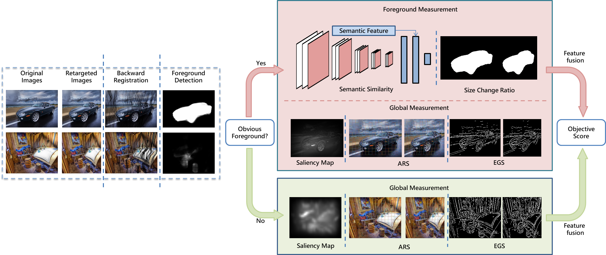

### Introduction
Implementation of paper [A Content-Aware Image Retargeting Quality Assessment Method Using Foreground and Global Measurement
](https://ieeexplore.ieee.org/abstract/document/8755987)
### Usage
Please manually modify the value of test_set to ['RetargetMe'](https://people.csail.mit.edu/mrub/retargetme/) or ['CUHK'](http://ivp.ee.cuhk.edu.hk/projects/demo/retargeting/index.html) in code/main.m to decide which dataset you want to process.
### Pre-calculated Data
We offer 3 types of pre-calculated data including:  
* Image Alignment result
* Saliency maps
* Hidden layer vectors of vgg16
### Citation
If you find this work useful, please consider citing

```
@article{li2019content,
  title={A Content-Aware Image Retargeting Quality Assessment Method Using Foreground and Global Measurement},
  author={Li, Yuwei and Guo, Lihua and Jin, Lianwen},
  journal={IEEE Access},
  volume={7},
  pages={91912--91923},
  year={2019},
  publisher={IEEE}
}
```
